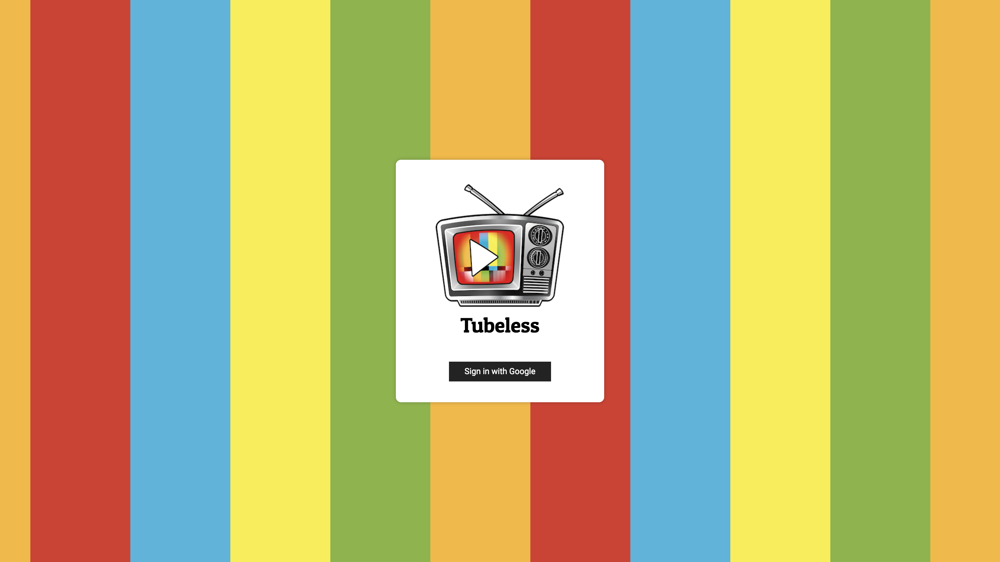
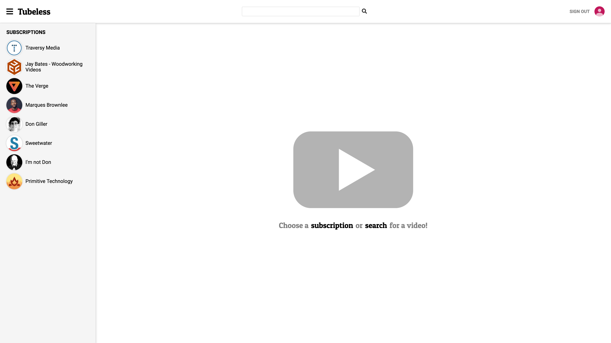
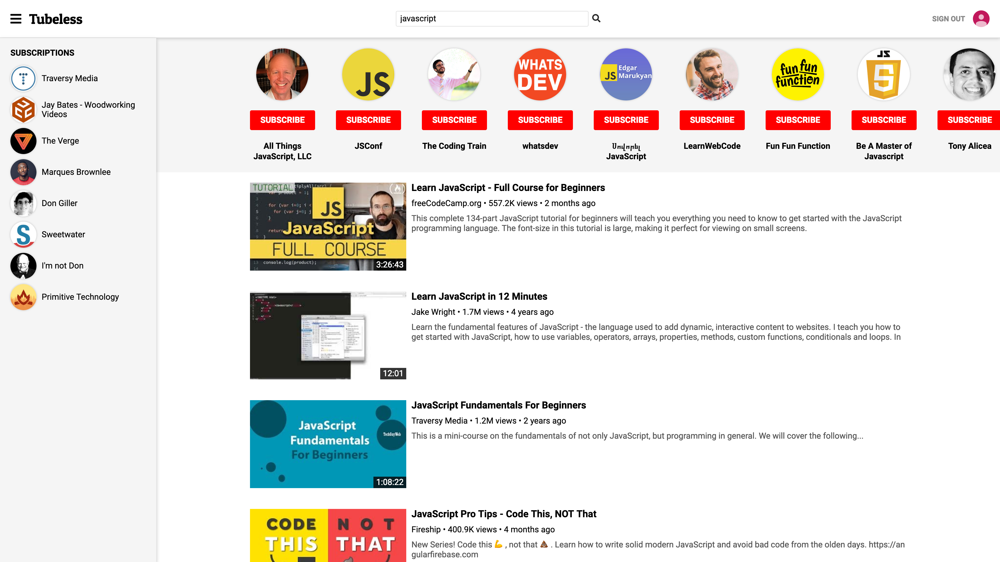

# Tubeless

Tubeless is a simplified application that uses the YouTube Data API to give you direct access to the videos you want to see. View the uploads of your subscribed channels or search for something specific. No recommended videos, no comments, no likes, and no dislikes. Just your favorite videos!

## Getting Started

Link to live site: https://tubeless.herokuapp.com/

### Instructions

#### Sign in with Google
<kbd>

</kbd>

In order to manage YouTube subscriptions, the user must sign in with their existing Google account or create a new one.

#### Subscriptions
<kbd>

</kbd>

A list of the user's subscriptions appear in the side bar on the left of the page. When in mobile the side bar is collapsed by default.

#### Channel Videos
<kbd>

</kbd>

When the user clicks on a subscription in the side bar, they are navigated to a list of that channel's videos. Above the list of videos is a header that has the name of the channel, the thumbnail image for the channel, and a button to subscribe or unsubscribe from the channel.

#### Search
<kbd>

</kbd>

By using the search bar in the nav bar at the top of the screen, the user can simultaneously search for videos and channels based on one search term.
A list of channels will appear just below the nav bar and the user can scroll through horizontally to see more results. Here, the user can click to view a channel's videos or subscribe to, or unsubscribe from, the channel.

Video search results will be listed vertically down the page. If the user clicks on the the video thumbnail or title, they will be taken to a page to watch the video. If the user clicks on the channel name, they will be taken to a page with all of that channel's videos.

#### Video Player
<kbd>

</kbd>

After clicking on a video, whether in a list of channel uploads or search results, the user is taken to a page that contains the video itself, the amount of views the video has, the name of the channel that uploaded the video, the date the video was uploaded, and the video description. Also there is a button to subscribe or unsubscribe from the channel that uploaded the video.

## Technologies Used

  1. [Node](https://nodejs.org/en/) and [Express](https://expressjs.com/) to create the server.
  2. [MongoDB](https://developers.google.com/youtube/v3/) to store user data.
  3. [React](https://reactjs.org/) for the front end.
  4. [YouTube Data API](https://developers.google.com/youtube/v3/) for all video data.
  5. [Font Awesome](https://fontawesome.com/) for icons.
